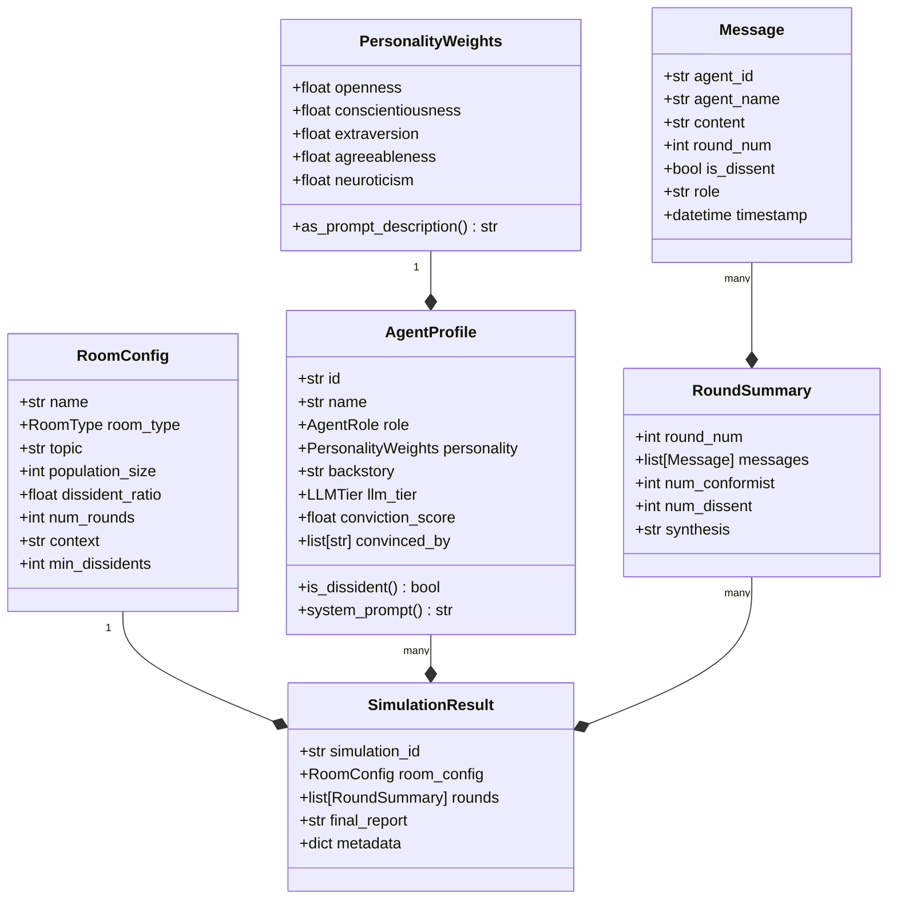
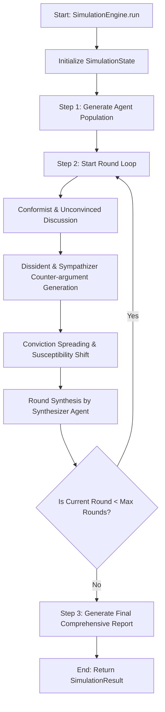

# Technical Specification: Adversarial Population Sandbox (APS)

This document details the core technical design, domain models, execution pipeline, and mathematical formulations for opinion dynamics in the Adversarial Population Sandbox.

---

## 1. Domain Model Schemas (Pydantic)

The system relies on strong validation schemas using Pydantic. These schemas are defined across `aps.schemas`:

---

## 2. Execution Pipeline

The simulation follows a state machine flow managed by the `SimulationEngine` (`aps.orchestrator.graph`):

1. **Agent Generation**: The `PersonaBuilder` dynamically creates a population with:
   - $N_{dissidents} = \max(1, \lceil N_{population} \times R_{dissident\_ratio} \rceil)$
   - $N_{synthesizer} = 1$ (Reserved slot)
   - $N_{conformists} = N_{population} - N_{dissidents} - N_{synthesizer}$
2. **Discussion Phase**: Conformist agents discuss the topic based on their backstories and recent context.
3. **Persuasion & Persisting Dissent**: Dissidents write adversarial responses targeting the conformist consensus. 
4. **Cascade Update**: Conformist conviction scores are updated. Those crossing the conviction threshold ($0.5$) are flagged as sympathizers.
5. **Round Synthesis**: A dedicated synthesizer agent compiles the round's agreements and disagreements.

---

## 3. Mathematical Formula: Conviction Spreading

Each conformist agent's conviction score $C_i \in [0.0, 1.0]$ updates at the end of round $t$ according to:

$$C_i^{(t)} = \min\left(1.0, C_i^{(t-1)} + \Delta C_i^{(t)}\right)$$

Where the shift $\Delta C_i^{(t)}$ is determined by:

$$\Delta C_i^{(t)} = B \times S_i \times (1.0 + P_{social}^{(t)}) \times (1.0 + 0.1 \times t) \times \epsilon$$

### Variables & Modifiers:

1. **Base Shift ($B$)**: A constant factor representing default susceptibility. Fixed at `BASE_CONVICTION_SHIFT = 0.20`.
2. **Individual Susceptibility ($S_i$)**: Derived from the agent's Big Five personality weights:
   $$S_i = 0.30 \cdot O + 0.25 \cdot A + 0.20 \cdot N - 0.10 \cdot C + 0.10 \cdot E$$
   *Where $O$ = Openness, $A$ = Agreeableness, $N$ = Neuroticism, $C$ = Conscientiousness, $E$ = Extraversion.*
   $S_i$ is clamped to $[0.1, 1.0]$ to ensure no agent is fully immune to persuasion.
3. **Social Pressure ($P_{social}^{(t)}$)**: The ratio of active dissidents and sympathizers currently speaking in the debate:
   $$P_{social}^{(t)} = \frac{N_{dissidents} + N_{sympathizers}^{(t)}}{N_{total}}$$
4. **Round Accumulation Modifier ($1.0 + 0.1 \times t$)**: Models cumulative cognitive fatigue and repeat exposure.
5. **Random Variance ($\epsilon$)**: Uniformly distributed noise $\epsilon \sim U(0.7, 1.3)$ to model micro-scale persuasion fluctuations.

---

## 4. Conviction Conversion Threshold

- **Conformist ($C_i < 0.5$)**: The agent speaks from their initial position, agreeing with the consensus.
- **Sympathizer ($C_i \ge 0.5$)**: Once the conviction score crosses the **`CONVICTION_THRESHOLD = 0.5`**, the agent joins the dissident faction. In subsequent rounds:
  - Their role hint is switched to `"conviction"`.
  - Their system prompt instructs them to explain why they changed their mind, becoming an additional source of dissident influence.
