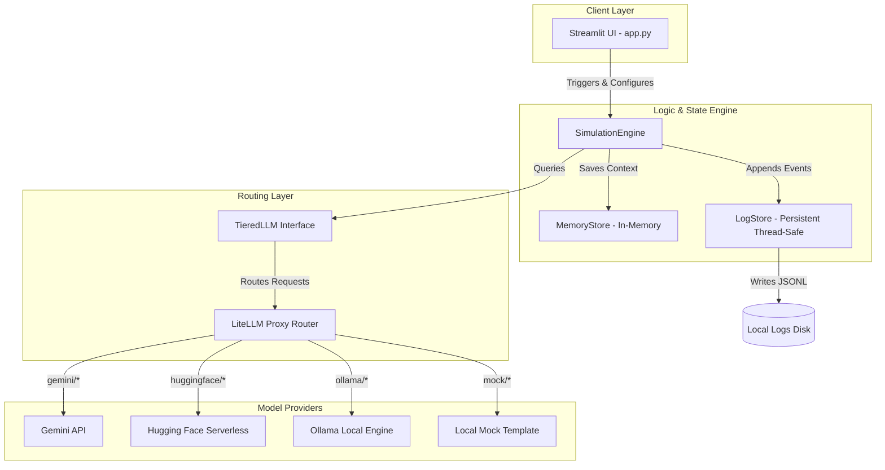
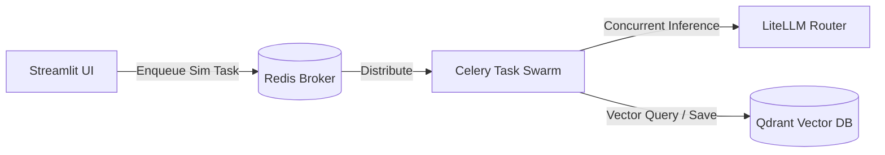

# Tech Stack & Infrastructure: Adversarial Population Sandbox (APS)

This document maps out the system architecture, dependencies, local/cloud execution patterns, and blueprints for high-throughput scaling.

---

## 1. Core Technology Stack

The framework is built entirely in Python using modern web and LLM tooling.

### Language & Frameworks
- **Runtime**: Python $\ge 3.11$
- **Frontend / Dashboard**: **Streamlit** (v1.35+)
- **Structured Data Modeling**: **Pydantic v2** for system configurations, messaging schemas, and state persistence.
- **Environment Management**: **Pydantic Settings** for validation and loading of `.env` configurations.

### LLM Orchestration & Inference Routing
- **LiteLLM**: Used as a unified interface proxy to handle API calls to multiple model providers. It allows runtime swapping of:
  - **Google Gemini API** (`gemini/gemini-2.5-pro`, `gemini/gemini-2.5-flash`)
  - **Ollama (Local)** (e.g. `ollama/llama3.2`)
  - **Hugging Face Serverless Hub** (e.g. `huggingface/meta-llama/Llama-3-8b-instruct`)
  - **Mock Mode** (Template-driven offline response system)

---

## 2. Infrastructure Architecture

The following diagram outlines the logical components and communication channels during a live simulation run.

### Data Storage & Logging
1. **Agent Context (`aps.memory.store`)**: An in-memory cache organized by simulation ID and round number. It builds chronological context windows injected into subsequent LLM prompts.
2. **Event & Message Persistence (`aps.log_store`)**: Thread-safe append-only file logger that saves structured entries directly to `.jsonl` files on local storage (`logs/<simulation_id>.jsonl`). It maintains an in-memory buffer and uses thread locks to ensure write integrity.

---

## 3. High-Throughput Scaling Blueprint (Future Plan)

To scale the simulation to 1,000+ agents without blocking UI execution, the following infrastructure changes are planned:

1. **Celery Task Swarm**: Move the agent execution loop out of the main thread and run agents concurrently in worker pools.
2. **Redis Message Broker**: Used for Celery backend job queuing, tracking simulation progress, and orchestrating worker concurrency.
3. **Qdrant Vector Database**: Replace the local in-memory `MemoryStore` with Qdrant to support semantic search, long-term memory lookup, and vector retrieval across thousands of messages.
